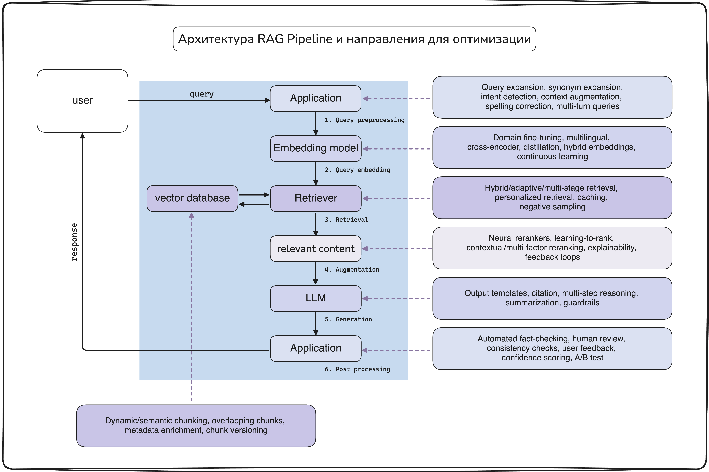

# RAG Pipeline - basics
**общая схема и точки улучшения для RAG Pipeline**

| Block      | Potential Improvements |
|-----------|-------|
| Vector Database      | Dynamic/semantic chunking, overlapping chunks, metadata enrichment, chunk versioning |
| Application (Query)      | Query expansion, synonym expansion, intent detection, context augmentation, spelling correction, multi-turn queries |
| Embedding Model      | Domain fine-tuning, multilingual, cross-encoder, distillation, hybrid embeddings, continuous learning |
| Retriever      | Hybrid/adaptive/multi-stage retrieval, personalized retrieval, caching, negative sampling |
| Reranking      | Neural rerankers, learning-to-rank, contextual/multi-factor reranking, explainability, feedback loops |
| LLM      | Output templates, citation, multi-step reasoning, summarization, guardrails |
| Output Validation      | Automated fact-checking, human review, consistency checks, user feedback, confidence scoring, A/B test |
